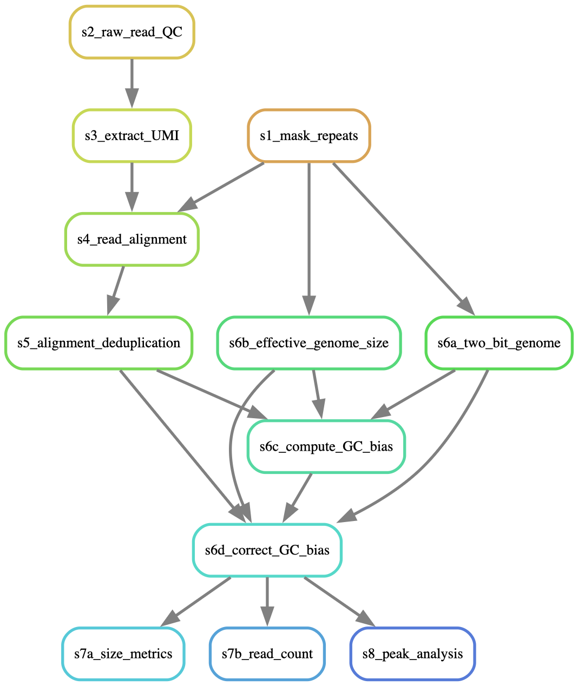
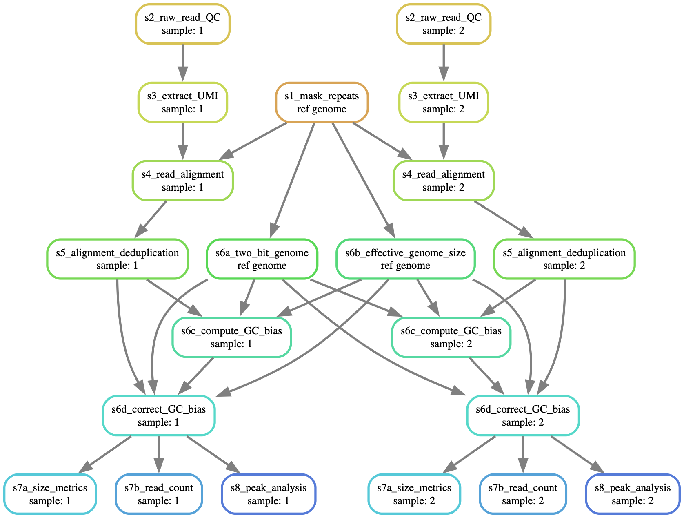

Some key points to remember:

- Detailed instructions on running the pipeline are available in the `README.md` file
- All file paths in this document assume the working directory is the `chromatin-assembly/` folder

-----

## Installation

#### Local installation
If running the pipeline locally, follow the [Installation](https://snakemake.readthedocs.io/en/stable/getting_started/installation.html) 
instructions from the Snakemake documentation. The Snakemake documentation 
recommends installing/loading Snakemake into a conda environment.

You will also need to install `graphviz` to visualise the Snakemake pipeline.

#### CSIRO HPC
On the CSIRO system Petrichor, Snakemake is available in the `python` module. 

Load it with:

```
module load python
```

The `graphviz` module allows you to create plots of the logic within the pipeline. 

Load it with:

```
module load graphviz
```

-----

## Dry runs
A dry run allows you to test the workflow prior to performing computationally 
expensive rule execution.

To perform a dry run (with 1 core):
```
snakemake -n -p -c1
```

This will output the rules that would be run if the pipeline was executed.

To ensure the dry run includes all rules:
```
snakemake -n -p --forceall -c1
```

-----

## Visualising the Snakemake process

There are two main ways to visualise the Snakemake pipeline:

- A rulegraph shows the relationships between the different rules in the pipeline.
- A DAG (directed acyclic graph) shows how individual files pass through the 
pipeline by creating a node for each job (i.e., a job for each sample in the reads)
and connecting them via dependencies. 

#### Rulegraph 

To generate a rulegraph:
```
snakemake -n -p --forceall --rulegraph | dot -Tpdf > rulegraph.pdf
```

```{r, echo=FALSE, fig.alt="Graph showing the order of and relationship between pipeline steps.", out.width = "50%"}

```

#### DAG

To generate a DAG:
```
snakemake -n -p --forceall --dag | dot -Tpdf > dag.pdf
```

A DAG (directed acyclic graph) shows the path that individual files take through the pipeline. A DAG can be difficult to interpret when running a pipeline with many samples, as the number of arrows/boxes makes the graph visually cluttered.

In this DAG, all pipeline steps are applied to two samples (`1` and `2`). Samples `1` and `2` are input into 
Step 2 (s2_raw_read_QC) and Step 3 (s3_extract_UMI). Each sample requires a separate run of the pipeline. Luckily, in Snakemake we can automate this process by providing a list of sample IDs in the `chromatin_assembly_config.yml` file.

The reference genome is the input data for Step 1 (s1_mask_repeats). Steps involving only the reference genome (Steps 1, 6a and 6b) only have to be performed once, and the output is used multiple times (once for each sample).

For most pipeline steps, the input to a given step is the output of a previous step.


```{r, echo=FALSE, fig.alt="Graph showing the order of and relationship between pipeline steps.", out.width = "100%"}

```

-----

## Useful command line options

Some command line options you may find useful (for Snakemake v7.24.0)

For further details, see the Snakemake documentation page --
[Snakemake: All command line options](https://snakemake.readthedocs.io/en/v7.24.0/executing/cli.html#all-options).

| Command option | Usage example | Explanation |
| --- | --- | --- |
| `--snakefile`, `-s` | `-s {SNAKEFILE}` | Specify the Snakefile. You will not need to specify the Snakefile as input -- by default, Snakemake looks for the snakefile at `Snakefile` and `workflow/Snakefile`. In this repository, the Snakefile is located at `workflow/Snakefile`. |
| `--dry-run`, `--dryrun`, `-n` | `-n` | Perform dry run - do not execute anything, but display would would be run |
| `--printshellcmds`, `-p` | `-p` | Print the shell commands that will be executed |
| `--cores`, `-c` | `-cN` | Use at most`N` CPU cores. Sets maximum number of cores requested from cluster or scheduler |
| `--jobs`, `-j` | `-jN` | Use at most `N` CPU cluster jobs in parallel. For local execution, use `--cores` |
| `--resources`, `--res` | `--res mem_mb=1000` | Define additional resources to constrain scheduler (e.g. allowed memory) |
| `--configfile`, `--configfiles` | `--configfile {target}` | Overwrite config file with file at provided file path |
| `--force`, `-f`| `-f` | Force execution of target/rule regardless of existing output | 
| `--forceall`, `-F` | `-F {target}` or `-F` | Force execution of selection rule (or first rule if rule is unspecified) and all rules it is dependent on regardless of existing output |
| `--forcerun` `-R` | `-R` | Force re-execution of given rule/file. Used if a rule has been changed. |
| `--until`, `-U` | `-U {target}` |Run pipeline until it reaches target rule/file |
| `--omit-from`, `-O` | `-O {target}` | Prevent execution of the target rule/file and any downstream rules/files |
| `--slurm` | `--slurm` | Execute snakemake rules as SLURM batch jobs according to their ‘resources’ definition. SLURM resources as ‘partition’, ‘ntasks’, ‘cpus’, etc. need to be defined per rule within the ‘resources’ definition. |
| `--profile` | `--profile {target}` | Path for workflow profile used to configure Snakemake with parameters for a specific workflow (e.g., allowed resources for Slurm) |
| `--configfile` | `--configfile {target}` | Specify or overwrite the config file of the workflow. Provide path relative to current directory. Allows separate config files for different analyses. |

-----

## Resources

From the Snakemake 8.28.0 documentation:

- [Command line interface](https://snakemake.readthedocs.io/en/stable/executing/cli.html) 
- [All command line options](https://snakemake.readthedocs.io/en/stable/executing/cli.html#all-options)
- [Using environment modules](https://snakemake.readthedocs.io/en/stable/snakefiles/deployment.html#using-environment-modules) 
- [Resources and remote execution](https://snakemake.readthedocs.io/en/stable/snakefiles/rules.html#resources-remote-execution)

Executing Snakemake on a HPC/cluster using Slurm:

- [snakemake-executor-plugin-slurm](https://github.com/snakemake/snakemake-executor-plugin-slurm/tree/main)
- [snakemake-executor-plugin-slurm documentation](https://snakemake.github.io/snakemake-plugin-catalog/plugins/executor/slurm.html#snakemake-executor-plugin-slurm)
- [bioconda/packages/snakemake-executor-plugin-slurm](https://anaconda.org/bioconda/snakemake-executor-plugin-slurm)

Other resources:

- [The Snakemake wrappers repository](https://snakemake-wrappers.readthedocs.io/en/stable/index.html) 
has wrappers for using popular tools as Snakemake rules (e.g., BAMTools, 
BCFTools, FastQC, FGBio, DeepTools, Picard)
- [Managing Workflows with Snakemake](https://eriqande.github.io/eca-bioinf-handbook/snakemake-chap.html),
in Anderson, E. C. 2024, [Practical Computing and Bioinformatics for Conservation and Evolutionary Genomics](https://eriqande.github.io/eca-bioinf-handbook/), Accessed 21/02/2025


