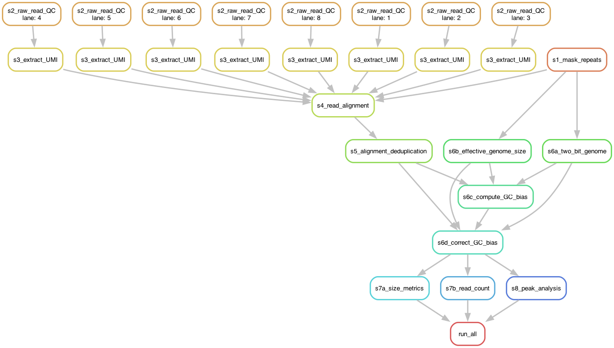

Some key points to remember:

- All file paths in this document assume the working directory is the `chromatin-assembly/` folder


## Installation

#### Local installation
If running the pipeline locally, follow the [Installation](https://snakemake.readthedocs.io/en/stable/getting_started/installation.html) 
instructions from the Snakemake documentation. The Snakemake documentation 
recommends installing/loading Snakemake into a conda environment.

You will also need to install `graphviz` to visualise the Snakemake pipeline.

#### CSIRO HPC
On the CSIRO system Petrichor, Snakemake is available in the `python` module. Load it with:

```
module load python
module load graphviz
```

The `graphviz` module allows you to create plots of the logic within the pipeline.

## Dry runs
A dry run allows you to test the workflow prior to performing computationally 
expensive rule execution.

To perform a dry run (with 1 core):
```
snakemake -n -p -c1
```

This will output the rules that would be run if the pipeline was executed.

To ensure the dry run includes all rules:
```
snakemake -n -p --forceall -c1
```

## Visualising the Snakemake process

There are two main ways to visualise the Snakemake pipeline. 

A rulegraph shows the relationships between the different rules in the pipeline.
A DAG (directed acyclic graph) shows how individual files pass through the 
pipeline by creating a node for each job (i.e., a job for each lane in the reads)
and connecting them via dependencies. 

#### Rulegraph 

To generate a rulegraph:
```
snakemake -n -p --forceall --rulegraph | dot -Tpdf > rulegraph.pdf
```

```{r, echo=FALSE, fig.alt="Graph showing the order of and relationship between pipeline steps.", out.width = "50%"}
knitr::include_graphics("figures/rulegraph.png")
```

#### DAG

To generate a DAG:
```
snakemake -n -p --forceall --dag | dot -Tpdf > dag.pdf
```

This is an example DAG for a test data set with reads for 8 lanes.

```{r, echo=FALSE, fig.alt="Graph showing the order of and relationship between pipeline steps.", out.width = "100%"}

```


## Local use
1. Clone the `chromatin-assembly` repository into the location you wish to run 
the pipeline in, then navigate into the `chromatin-assembly` folder. 
2. Copy your input data into the `data/` folder. 
3. Update the file paths and variables within the `config/chromatin-assembly-config.yml`
file.
4. *If using conda environments:* Open the conda environment: `conda activate snakemake`
5. Perform a dry run (with 1 core): `snakemake -n -p -c1`
6. Run the snakemake pipeline with one core: `snakemake -c1` 

#### Controlling pipeline execution
Instead of running the entire pipeline with 1 core, you can control which
steps are executed and what computational resources are allowed.

To run the entire pipeline with `N` cores: 
```
snakemake -cN
```

To run the pipeline until it reaches a certain rule, use `snakemake --until {target}`
(where `{target}` is the rule name). For example, to execute Steps 1-3:
``` 
snakemake --until s3_extract_UMI  -cN
```

To omit steps from the pipeline (i.e., run the pipeline without executing a
specific rule or any downstream rules) use `snakemake --omit {target}`. Any 
step can be omitted. Execution of the pipeline will stop when downstream rules
become dependent on completion of the target rule. For example, to omit Step 8
(peak analysis in DANPOS3):
```
snakemake --omit s8_peak_analysis -cN
```

The `--until` and `--omit` flags can be combined, for example if you want to process
Steps 2-3 (raw read quality control and extract UMIs) without executing Step 1 
(mask repeats):
```
snakemake --until s3_extract_UMI --omit s1_mark_repeats -cN
```

You can also execute a single rule of the pipeline by using the desired output 
file path with `snakemake {output_file_path}`. For example, to execute Step 5 
(alignment deduplication):
```
snakemake -p results/step5_dedup.txt
```

TODO update output filepath for step 5

## HPC use

#### Preparing the conda environment

Snakemake provides a plugin called [snakemake-executor-plugin-slurm](https://snakemake.github.io/snakemake-plugin-catalog/plugins/executor/slurm.html#snakemake-executor-plugin-slurm) to facilitate Slurm use. 

To create a conda environment for use with Snakemake and Slurm:

- Create new conda environment with the name `slurm_snakemake`
  - `$ conda create -n slurm_snakemake`
- Activate the new environment
  - `$ conda activate slurm_snakemake`
- Configure conda to enable the bioconda channel
  - `$ conda config --add channels bioconda`
  - `$ conda config --add channels conda-forge`
- Load the python module (which contains Snakemake)
  - `$ module load python`
- Load the graphviz module (to allow pipeline visualisation)
  - `$ module load graphviz`
- Install the [snakemake-executor-plugin-slurm](https://snakemake.github.io/snakemake-plugin-catalog/plugins/executor/slurm.html#snakemake-executor-plugin-slurm) plugin from 
[bioconda](https://anaconda.org/bioconda/snakemake-executor-plugin-slurm) 
  - `$ conda install bioconda::snakemake-executor-plugin-slurm`
- Save a list of the packages in the conda environment as YAML format
  - `$ conda env export -n slurm_snakemake > slurm_snakemake_conda.yaml`
- Save a list of the loaded modules as a text file
  - `$ module list > slurm_snakemake_modules.txt`

### Specifying resources
https://snakemake.github.io/snakemake-plugin-catalog/plugins/executor/slurm.html#advanced-resource-specifications

To specify account and partition in the command line:
```
snakemake --executor slurm --default-resources slurm_account=<your SLURM account> slurm_partition=<your SLURM partition>
```

Account and partition details can also be specified using a configuration profile. 
```
snakemake --executor slurm --workflow-profile profiles/slurm/config.yaml
```

Some notes on [Running Snakemake on a cluster](https://docs.s3it.uzh.ch/how-to_articles/how_to_run_snakemake/#resources):

- Resources can be referenced within a rule's `shell` and `run` sections e.g., `{resources.mem_mb}`, `{resources.threads}`
  - This is useful for applications that accept memory or thread parameters in the command line
  - For example, in rule `s2_raw_read_QC`: `fastqc -t {resources.threads} {input.r1} {input.r2} -o {params.outdir}` 
- Snakefiles and configuration profiles can specify both `threads` and `cpus_per_task`
  - `cpus_per_task` is specific to Slurm.
  - `threads` is independent of environment and always available, even when not explicitly set for a rule. 
  - `threads` can be determined based on how well the task can be parallelised
  - Snakemake uses `threads` to determine how many jobs to execute when running a pipeline locally
To specify


#### Running pipeline on the HPC
1. Clone the `chromatin-assembly` repository into the location you wish to run 
the pipeline in, then navigate into the `chromatin-assembly` folder. 
2. Copy your input data into the `data/` folder. 
3. Update the file paths and variables within the `config/chromatin-assembly-config.yml`
file.
4. Update the Slurm resources in the `profiles/slurm/config.yaml` file
5. Open the conda environment: `conda activate slurm_snakemake`
6. Perform a local dry run to identify any issues:
```
snakemake -n -p -c1
```
7. Execute the desired rules using the `--executor` flag and the slurm workflow profile (and other commands as desired):
```
snakemake --executor slurm -workflow-profile profiles/slurm/config.yaml ...
```

As when executing locally, pipeline execution can be limited to specific rules
by adding flags to the Snakemake command line call.
For example: 

- Execute Steps 1--3: `--until s3_extract_UMI`
- Execute pipeline, omitting Step 8: `--omit s8_peak_analysis`
- Execute Steps 2-3: `--until s3_extract_UMI --omit s1_mark_repeats`

The complete command line to execute Steps 2-3 would be:
```
snakemake --executor slurm -workflow-profile profiles/slurm/config.yaml --until s3_extract_UMI --omit s1_mark_repeats
```

## Useful command line options

Some command line options you may find useful.

For further details, see the Snakemake documentation page 
[All command line options](https://snakemake.readthedocs.io/en/stable/executing/cli.html#all-options).

| Command option | Usage example | Explanation |
| --- | --- | --- |
| `--snakefile`, `-s` | `-s {SNAKEFILE}` | Specify the Snakefile. You will not need to specify the Snakefile as input -- by default, Snakemake looks for the snakefile at `Snakefile` and `workflow/Snakefile`. In this repository, the Snakefile is located at `workflow/Snakefile`. Use only if you have a specific snakefile to use in a different location. |
| `--dry-run`, `--dryrun`, `-n` | `-n` | Perform dry run - do not execute anything, but display would would be run |
| `--printshellcmds`, `-p` | `-p` | Print the shell commands that will be executed |
| `--cores`, `-c` | `-cN` | Use at most`N` CPU cores. Sets maximum number of cores requested from cluster or scheduler |
| `--jobs`, `-j` | `-jN` | Use at most `N` CPU cluster jobs in parallel. For local execution, use `--cores` |
| `--resources`, `--res` | `--res mem_mb=1000` | Define additional resources to constrain scheduler (e.g. allowed memory) |
| `--configfile`, `--configfiles` | `--configfile {target}` | Overwrite config file with file at provided file path |
| `--force`, `-f`| `-f` | Force execution of target/rule regardless of existing output | 
| `--forceall`, `-F` | `-F {target}` or `-F` | Force execution of selection rule (or first rule if rule is unspecified) and all rules it is dependent on regardless of existing output |
| `--forcerun` `-R` | `-R` | Force re-execution of given rule/file. Used if a rule has been changed. |
| `--until`, `-U` | `-U {target}` |Run pipeline until it reaches target rule/file |
| `--omit-from`, `-O` | `-O {target}` | Prevent execution of the target rule/file and any downstream rules/files |
| `-executor`, `-e` | `-e {executor}` i.e., `-e slurm` or `-e local` | Specify a custom executor - use `slurm` for HPC execution |
| `--workflow-profile` | `--workflow-profile {target}` | Path (relative to current directory) for workflow profile used to configure Snakemake with parameters for a specific workflow (e.g., allowed resources for Slurm) |

## Documentation and resources

From the Snakemake 8.28.0 documentation:

- [Command line interface](https://snakemake.readthedocs.io/en/stable/executing/cli.html) 
- [All command line options](https://snakemake.readthedocs.io/en/stable/executing/cli.html#all-options)
- [Using environment modules](https://snakemake.readthedocs.io/en/stable/snakefiles/deployment.html#using-environment-modules) 
- [Resources and remote execution](https://snakemake.readthedocs.io/en/stable/snakefiles/rules.html#resources-remote-execution)

Executing Snakemake on a HPC/cluster using Slurm:

- [snakemake-executor-plugin-slurm](https://github.com/snakemake/snakemake-executor-plugin-slurm/tree/main)
- [snakemake-executor-plugin-slurm documentation](https://snakemake.github.io/snakemake-plugin-catalog/plugins/executor/slurm.html#snakemake-executor-plugin-slurm)
- [bioconda/packages/snakemake-executor-plugin-slurm](https://anaconda.org/bioconda/snakemake-executor-plugin-slurm)

Other resources:

- [The Snakemake wrappers repository](https://snakemake-wrappers.readthedocs.io/en/stable/index.html) 
has wrappers for using popular tools as Snakemake rules (e.g., BAMTools, 
BCFTools, FastQC, FGBio, DeepTools, Picard)
- [Managing Workflows with Snakemake](https://eriqande.github.io/eca-bioinf-handbook/snakemake-chap.html),
in Anderson, E. C. 2024, [Practical Computing and Bioinformatics for Conservation and Evolutionary Genomics](https://eriqande.github.io/eca-bioinf-handbook/), Accessed 21/02/2025


