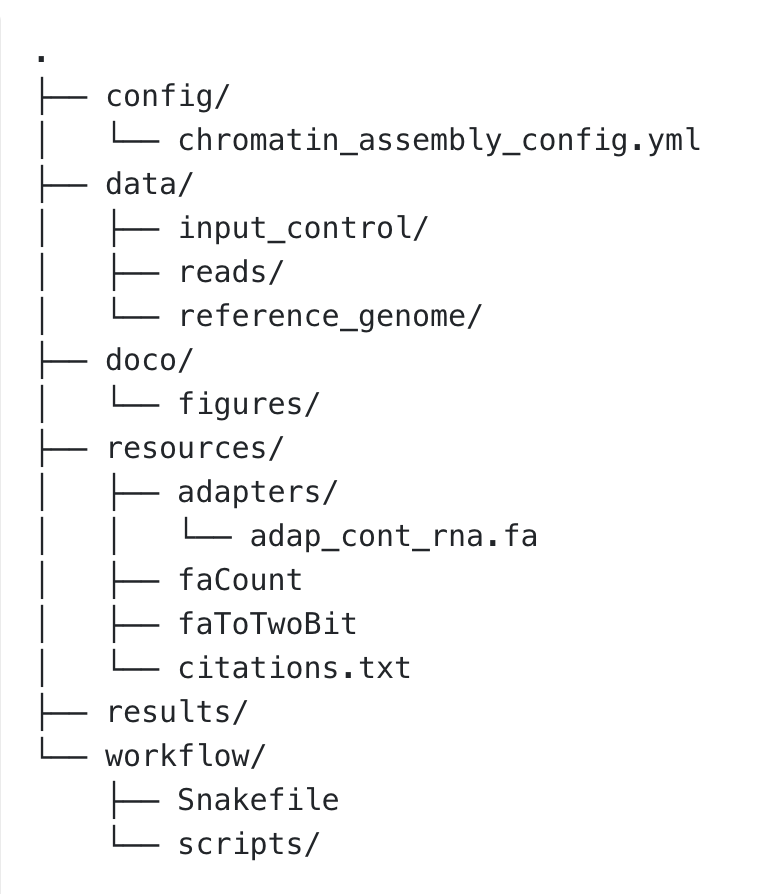
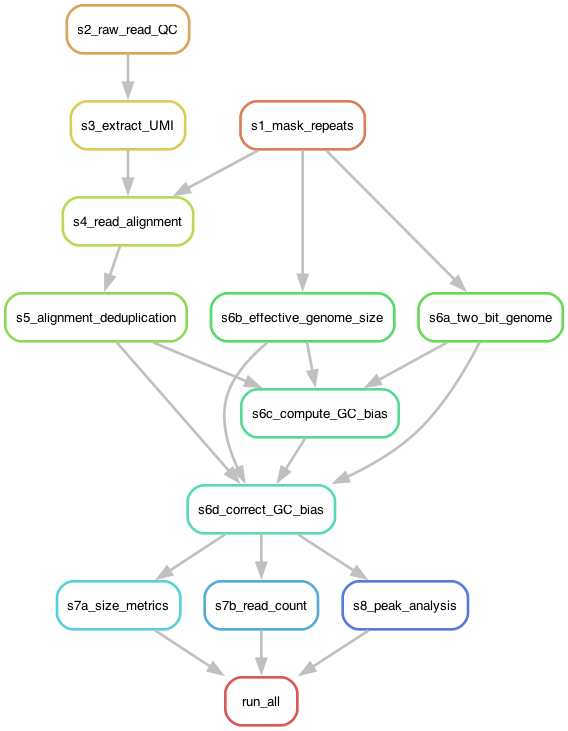

## Background
TODO ask Erin to write introduction para

## Repository Structure
The `caitlinch/chromatin-assembly` GitHub repository has the following structure:

```{r, echo=FALSE, fig.alt="Structure of the chromatin-assembly GitHub repository", out.width = "40%"}

```


The directories included are:

- `config/`
  - Includes the `.yml` config file used to specify file paths, input parameters and HPC resources
- `data/`
  - For storing input data
- `doco/`
  - Includes documentation on pipeline use and modifying input parameters
- `resources/`
  - Includes scripts and adapters used within the pipeline steps
- `results/`
  - For storing output
- `workflow/`
  - Includes the Snakefile, located at `workflow/Snakefile`, which makes this whole pipeline go
  - Includes the BASH scripts from which this Snakemake pipeline was developed

## Pipeline steps

Running the pipeline from start to finish will execute the following steps:

- Step 1: Repeat masking and suffix array using RepeatMasker and kit4b
- Step 2: Raw read quality control with FastQC
- Step 3: UMI extraction with FGBio and Picard
- Step 4: Align reads with kalign
- Step 5: Remove PCR and optical duplicates from alignment with Picard
- Step 6a: Generate 2Bit genome with faToTwoBit
- Step 6b: Calculate effective genome size with faCount
- Step 6c: Compute GC bias with deeptools
- Step 6d: Correct GC bias with deeptools
- Step 7a: Calculate alignment statistics with Picard
- Step 7b: Estimate mean nuclear genome cover with Picard
- Step 8: Peak analysis using DANPOS3

## Pipeline execution

The following graph shows the relationship between pipeline steps:

```{r, echo=FALSE, fig.alt="Graph showing the order of and relationship between pipeline steps.", out.width = "60%"}

```

