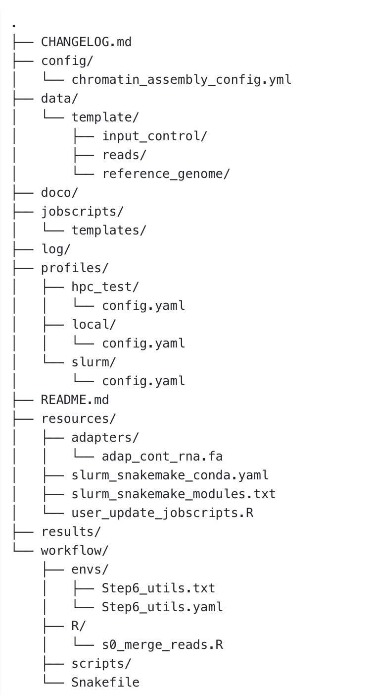

## Background
TODO ask Erin to write introduction para

## Repository Structure
The `caitlinch/chromatin-assembly` GitHub repository has the following structure:

```{r, echo=FALSE, fig.alt="Directory structure", out.width = "40%"}

```


The directory includes:

- `CHANGELOG.md`: record of changes and modifications
- `config/`
  - Includes the `chromatin_assembly_config.yml` file, which is used to specify file paths and input parameters
- `data/`
  - Input data (one folder per species), with a separate folder for:
    - `input_control/` -- reads used for peak analysis with DANPOS (Step 8)
    - `reads/` -- raw reads (in `fastq.gz` format)
    - `reference_genome/` -- reference genome for your species (in `.fasta` or `.fsa` format)
- `doco/`
  - Includes documentation on pipeline use and modifying input parameters
- `jobscripts/`
  - For Slurm jobscripts.
  - The `templates/` folder contains template jobscripts for running the pipeline. These templates must be updated with your desired Slurm parameters for email address, email delivery, and account ID. See `README.md` for details.
- `log/`
  - For output logs
- `profiles/`
  - Snakemake uses profiles to determine what computational resources to use for each step on each system
    - `hpc_test/config.yaml` -- for server (Petrichor) testing/development or dry runs
    - `local/config.yaml` -- for local (not server) testing/development or dry runs
    - `slurm/config.yaml` -- for use with Slurm on Petrichor
- `README.md` -- a quick-start guide on running the pipeline.
- `resources/`
  - `adapters/adap_cont_rna.fa` -- adapters used with RepeatMasker (Step 1)
  - `slurm_snakemake_conda.yaml` -- conda environment to be used with Snakemake v8 (not needed if running on Petrichor, which uses Snakemake v7 as of April 2025)
  - `slurm_snakemake_modules.txt` -- record of modules used (on Petrichor) for developing and testing the pipeline.
  - `user_update_jobscripts.R` -- a script to update the template jobscripts for use with your preferred SLURM details
- `results/`
  - For storing output
- `workflow/`
  - `Snakefile` -- makes the whole pipeline go
  - `envs/` -- conda environments used during pipeline runs
  - `R/`
    - `s0_merge_reads.R` -- the R script for merging reads
  - `scripts/` -- the BASH scripts from which this Snakemake pipeline was developed

## Pipeline steps

Running the pipeline from start to finish will execute the following steps:

- Step 1: Repeat masking and suffix array using RepeatMasker and kit4b
- Step 2: Raw read quality control with FastQC
- Step 3: UMI extraction with FGBio and Picard
- Step 4: Align reads with kalign
- Step 5: Remove PCR and optical duplicates from alignment with Picard
- Step 6a: Generate 2Bit genome with faToTwoBit
- Step 6b: Calculate effective genome size with faCount
- Step 6c: Compute GC bias with deeptools
- Step 6d: Correct GC bias with deeptools
- Step 7a: Calculate alignment statistics with Picard
- Step 7b: Estimate mean nuclear genome cover with Picard
- Step 8: Peak analysis using DANPOS3

## Pipeline execution

The following graph shows the relationship between pipeline steps:

```{r, echo=FALSE, fig.alt="Graph showing pipeline steps.", out.width = "60%"}
knitr::include_graphics("figures/rules_singleSample.png")
```

